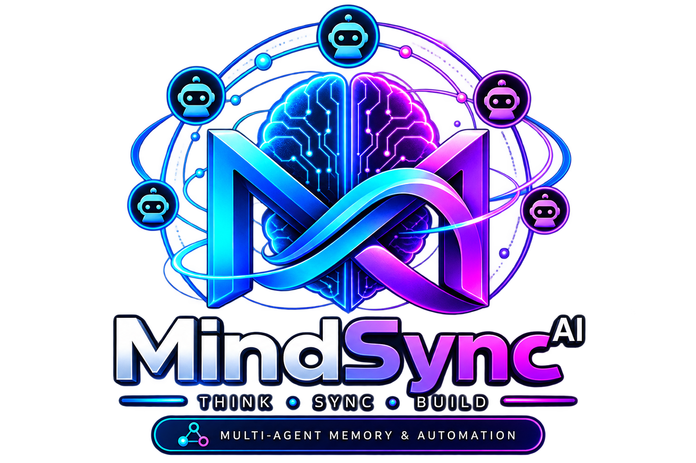

<div align="center">



# MindSync AI

**Local-first MCP orchestration, persistent shared memory, and automatic task routing for coding agents.**

[](https://github.com/adityarya24/mindsync-ai/actions/workflows/ci.yml)
[](https://pypi.org/project/mindsync-ai/)
[](https://pypi.org/project/mindsync-ai/)
[](LICENSE)
[](https://modelcontextprotocol.io/)

### 🌐 [adityarya24.github.io/mindsync-ai](https://adityarya24.github.io/mindsync-ai/)

</div>

---

## 💡 What is MindSync?

MindSync connects disparate AI coding agents (**Codex, Claude Code, Gemini CLI, Antigravity, Grok, Cursor, OpenCode, Aider**) into a single, coordinated local ecosystem without requiring a cloud SaaS account or third-party servers.

The human-facing CLI session you are talking to **remains in charge as the orchestrator**. MindSync routes subtasks by domain capability, enforces file locks to prevent multi-agent collisions, tracks rate limits for seamless quota handoff across providers, and preserves long-term factual memory across sessions.

```
                    ┌────────────────────────┐
                    │   You (Human Prompt)   │
                    └───────────┬────────────┘
                                │
                                ▼
         ┌────────────────────────────────────────────────┐
         │     Human-Facing CLI Session (Orchestrator)    │
         │  (e.g., Codex / Claude / Gemini / Grok / ...)   │
         └──────────────────────┬─────────────────────────┘
                                │ (MCP Protocol)
                                ▼
  ┌─────────────────────────────────────────────────────────────┐
  │                        MINDSYNC CORE                        │
  │  ┌───────────────────────┬───────────────────────────────┐  │
  │  │  Capability Router    │  Conflict Prevention Shield   │  │
  │  ├───────────────────────┼───────────────────────────────┤  │
  │  │  Quota & Handoff Tier │  Vector Memory (`sqlite-vec`) │  │
  │  └───────────────────────┴───────────────────────────────┘  │
  └─────────────────────────────┬───────────────────────────────┘
                                │ (Isolated Worktrees)
         ┌──────────────────────┼──────────────────────┐
         ▼                      ▼                      ▼
┌──────────────────┐  ┌──────────────────┐  ┌──────────────────┐
│   Codex Worker   │  │  Claude Worker   │  │  Gemini / Grok   │
│  (Implementation)│  │ (Deep Reasoning) │  │ (Audit & Search) │
└──────────────────┘  └──────────────────┘  └──────────────────┘
```

> **Key Guarantee**: Dispatched workers receive bounded tasks inside isolated Git worktrees and cannot recursively re-delegate through MindSync.

---

## ⚡ Quick Start

### 1. Installation
```bash
pip install mindsync-ai
```
*(Requires Python 3.10+)*

### 2. Automated Auto-Discovery & Setup
```bash
# Auto-detects installed MCP hosts and PATH coding CLIs
mindsync setup --mode auto

# Verify system health, lock engines, and adapter status
mindsync doctor

# Inspect available agent roster and capabilities
mindsync agents
```
*Restart your CLI sessions after setup to load the registered MCP servers.*

```bash
# Additional setup options
mindsync setup --dry-run          # Preview changes without modifying host configs
mindsync setup --cli grok         # Target a specific host only
mindsync setup --no-discover      # Register hosts without PATH CLI scanning
mindsync setup --no-hooks         # Skip Codex standalone hooks
```

---

## 🤖 Supported Clients & Roster

A CLI may act as an **MCP Host** (orchestrator), a **Worker** (dispatched execution), or both:

| CLI / Engine | MCP Host | Dispatched Worker | Domain Strength / Role |
| :--- | :---: | :---: | :--- |
| **OpenAI Codex** | Native | Yes | Fast implementation, refactoring, standalone memory hooks |
| **Anthropic Claude Code** | Native | Yes | Architecture, comprehensive reviews, massive context |
| **Google Gemini CLI** | Native | Yes | Research, multimodal analysis, tool integrations |
| **Antigravity (`agy`)** | Via Gemini | Yes | Preferred execution worker in Gemini family |
| **Grok CLI (xAI)** | Native | Yes | Codebase exploration, security audit, rapid synthesis |
| **Cursor Agent** | JSON (`mcp.json`) | Yes | In-IDE pair programming, file editing |
| **OpenCode** | JSON (`opencode.jsonc`)| Yes | Context-first systems counseling & multi-model routing |
| **Aider** | — | Yes | Surgical git diffs & local file edits |

> ℹ️ **Family Isolation**: Gemini CLI and `agy` share the `gemini-antigravity` family. When either is the human-facing orchestrator, both are excluded from automatic worker selection to protect orchestrator bandwidth.

---

## 🎯 Orchestration & Capability Dispatch

Policy configuration is located at `~/.mindsync/orchestration.json` (Modes: `auto`, `suggest`, `off`).

### Run Dispatched Jobs
```bash
# Route task automatically to best suited agent by capability
mindsync-dispatch run auto "implement and test the auth fix" --capability coding

# Check status of running or completed jobs
mindsync-dispatch status
```

### Automatic Provider Quota Handoff
MindSync prevents blocked workflows when an LLM provider's quota exhausts mid-task. When enabled with an isolated worktree, MindSync transfers the working state, task prompt, and latest checkpoint to a ranked successor agent:

```bash
# Run with worktree isolation and automatic quota handoff
mindsync-dispatch run auto "refactor database schema" --write --worktree --on-limit handoff

# Inspect provider and account cooldowns
mindsync-dispatch limits

# Clear cooldowns manually after operator verification
mindsync-dispatch limits clear
```

### Pre-emptive Usage Evaluation
MindSync includes pluggable usage readers. For example, the bundled **Codex OAuth Reader** (`codex-oauth`) reads local OAuth tokens from `~/.codex/auth.json` and evaluates primary and weekly usage windows before spawning tasks.

```json
{
  "usage": {
    "enabled": false,
    "defaultThresholdPercent": 90,
    "orchestratorReservePercent": 80,
    "pollingIntervalSeconds": 60
  }
}
```

* **`defaultThresholdPercent`**: Dispatched worker handoff threshold.
* **`orchestratorReservePercent`**: Threshold for warning the operator before starting large runs.
* If a provider reaches threshold and a MindSync checkpoint exists, dispatch safely transfers the worktree diff to the successor agent.

### Automated Pull Request Workflow
Configure MindSync to automatically publish branches and open PRs upon successful task completion:
```bash
# Enable PR creation upon successful completion for current repository
mindsync config onComplete pr --project .
```
*(MindSync never auto-merges PRs and strictly declines to publish if checks fail or if secrets/sensitive tokens are detected in diffs).*

---

## 🧠 Persistent Memory & Shared Facts

MindSync embeds a lightweight, local vector and relational database powered by `sqlite-vec` for cross-session knowledge retention:

```bash
# View memory database statistics
mindsync memory stats

# List recorded facts for a specific repository
mindsync memory list --project my-repo

# Semantic search across historical decisions and architecture facts
mindsync memory recall --project my-repo --query "database migration decision"
```

### MCP Tool Bundles
* **Orchestrator Hosts (16 Tools)**: Exposes full orchestration (`delegate_task`, `route_task`, `get_sync_context`, `update_focus`, `memory_checkpoint`, `memory_recall`, `queue_durable_fact`, etc.).
* **Dispatched Workers (12 Tools)**: Runs with `MINDSYNC_WORKER=1`, omitting recursive delegation tools while retaining shared context, focus locks, and fact retrieval.

---

## 🔒 Safety & Security Architecture

1. **Human-in-the-Loop Authority**: The human-facing orchestrator CLI always retains final approval and verification.
2. **Explicit Binary Execution**: `mindsync setup` only configures known recipes. Unknown binaries are suggested, never executed blindly.
3. **Crash-Safe Locking**: State updates use atomic writes and file locks. On Windows, lock contention timeouts are configurable via environment variables.
4. **Secret-Safe Serialization**: Job status, telemetry, and handoff payloads strictly strip access tokens, auth headers, and raw credential structures before logging.

---

## ⚙️ Advanced Configuration & Environment Variables

<details>
<summary><b>Click to expand Environment Variables</b></summary>

| Variable | Description | Default |
| :--- | :--- | :--- |
| `MINDSYNC_HOME` | Root configuration directory | `~/.mindsync` |
| `AGENT_DISPATCH_HOME` | Storage for dispatch jobs and rosters | `~/.mindsync/dispatch` |
| `MINDSYNC_CALLER_CLI` | Declares calling CLI engine identity | Auto-detected |
| `MINDSYNC_QUEUE_LOCK_TIMEOUT` | Max wait time for file locks (seconds) | `10.0` |
| `MINDSYNC_LOCK_CONTENTION_BACKOFF_BASE` | Backoff base for Windows lock contention | `0.05` |
| `MINDSYNC_SSH_HOST` | Remote VPS host for optional sync | — |
| `MINDSYNC_REMOTE_ROOT` | Remote VPS sync directory | — |

</details>

---

## 🛠️ Development & Testing

```bash
# 1. Clone repository
git clone https://github.com/adityarya24/mindsync-ai.git
cd mindsync-ai

# 2. Set up virtual environment
python -m venv .venv
source .venv/bin/activate  # On Windows: .venv\Scripts\activate

# 3. Install in editable mode with development dependencies
python -m pip install -e ".[dev]"

# 4. Run linter & test suite
python -m ruff check .
python -m pytest -q
```

---

## 📄 License

Distributed under the [MIT License](LICENSE). Open-source and free for personal and commercial use.
